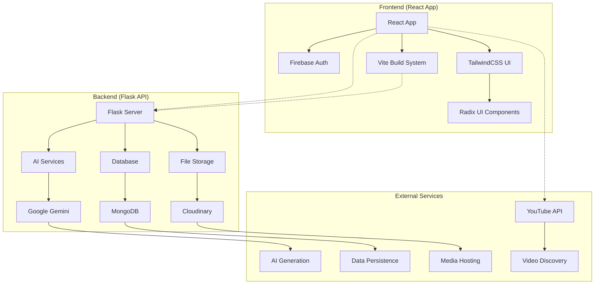

<div align="center">
	
</div>

# Edvanta
**AI-powered personalised learning & career acceleration platform**

A comprehensive full-stack educational platform that revolutionizes learning through artificial intelligence, offering personalized learning tools, beautiful responsive design, and seamless deployment across any platform.

<!-- Project badges -->
[](LICENSE) [](client/package.json) [](https://vercel.com)

## 🌟 Key Features

### **AI-Powered Learning Ecosystem**
- 🤖 **Intelligent Chatbot** - Context-aware doubt solving with conversation history
- 📝 **Smart Quiz System** - AI-generated personalized quizzes with automatic scoring
- 👨‍🏫 **AI Tutor** - Interactive conversational tutoring system
- 🗺️ **Learning Roadmaps** - Personalized learning paths with milestone tracking
- 📄 **Resume Builder** - AI-powered resume analysis and job-fit optimization
- 🎬 **Visual Content Explorer** - YouTube API integration for educational video discovery

### **Modern React Application**
- 📱 **Responsive Design** - Mobile-first interface optimized for all devices
- ⚡ **Lightning Fast** - Vite build system with optimized performance
- 🎨 **Beautiful UI** - TailwindCSS with Radix UI components
- 🔥 **Hot Reload** - Instant development feedback with Vite HMR
- 🌙 **Screen Fatigue Prevention** - Smart break reminders with timer reset
- 🌐 **Basic PWA** - Simple offline support with floating status indicator

### **Universal Deployment**
- 🌐 **Platform Agnostic** - Works on Vercel, AWS, Heroku, Google Cloud, locally
- 🚀 **Serverless Ready** - Optimized for serverless environments
- 📦 **Zero Configuration** - Auto-detects environment and adapts
- 🛡️ **Production Grade** - Built-in security, error handling, and monitoring
- 🔌 **Offline Access** - All pages remain accessible when connection is lost

## 🏗️ Architecture Overview



**Client (React App)** ↔ **REST API (Flask)** ↔ **AI Services (Gemini, Cloudinary, MongoDB)**

## 🎯 Feature showcase

Below are a few of the core features showcased visually — add screenshots or GIFs into `client/public/screenshots/` and reference them here for a polished demo.

- Intelligent Chatbot (context-aware doubt solving)
- AI Tutor (conversational tutoring)
- Smart Quiz System (personalized quizzes with auto-scoring)
- Resume Builder (analysis & job-fit suggestions)


## 📁 Project Structure

```
edvanta/
├── client/                          # React + Vite Frontend Application
│   ├── src/
│   │   ├── components/              # Reusable UI components
│   │   │   ├── Layout/              # Navigation (Navbar, Sidebar)
│   │   │   └── ui/                  # Design system components
│   │   │       ├── badge.jsx, button.jsx, card.jsx, input.jsx
│   │   │       ├── progress.jsx, tabs.jsx
│   │   │       ├── HeroSpline.jsx   # 3D hero section
│   │   │       ├── ScreenFatigueReminder.jsx # Break reminder system
│   │   │       ├── PageTransition.jsx # Smooth transitions
│   │   │       ├── ScrollToTop.jsx  # Auto-scroll component
│   │   │       ├── UserInterestForm.jsx # User preference form
│   │   │       └── custom-css/      # Custom CSS modules
│   │   ├── pages/                   # Route-based page components
│   │   │   ├── Home.jsx, Dashboard.jsx
│   │   │   ├── auth/                # Login, Signup
│   │   │   └── tools/               # AI learning tools
│   │   │       ├── ConversationalTutor.jsx # AI tutoring system
│   │   │       ├── DoubtSolving.jsx # AI chatbot for Q&A
│   │   │       ├── Quizzes.jsx     # Quiz generation & scoring
│   │   │       ├── ResumeBuilder.jsx # Resume analysis tool
│   │   │       ├── Roadmap.jsx     # Learning path generator
│   │   │       └── VisualContent.jsx # YouTube API video explorer
│   │   ├── hooks/                   # Custom React hooks
│   │   │   ├── useAuth.js, useResponsive.js, helper.js
│   │   └── lib/                     # Core utilities
│   │       ├── api.js               # Centralized API client
│   │       ├── firebase.js          # Firebase configuration
│   │       └── utils.js             # Helper functions
│   ├── public/                      # Static assets
│   │   ├── manifest.json, edvanta-logo.png, default-avatar.svg
│   ├── package.json, vite.config.ts, tailwind.config.js
│   └── .env.example                 # Environment template with full docs
└── server/                          # Flask Backend API
    ├── api/
    │   └── index.py                 # Vercel WSGI entry point
    ├── app/
    │   ├── __init__.py              # Application factory
    │   ├── config.py                # Environment configuration
    │   ├── routes/                  # API endpoints (blueprints)
    │   │   ├── chatbot.py, quizzes.py, tutor.py
    │   │   ├── roadmap.py, resume.py, user_stats.py
    │   └── utils/                   # Service integrations
    │       ├── ai_utils.py          # Gemini AI integration
    │       ├── cloudinary_utils.py, pdf_utils.py
    │       ├── mongo_utils.py, quizzes_utils.py
    ├── app.py                       # Local development entry point
    ├── requirements.txt, runtime.txt, vercel.json
    └── .env.example                 # Environment template with full docs
```

## 🚀 Quick Start

### Quick start (under 5 minutes)
If you want to get the app running locally quickly, this 2–5 minute flow will get both client and server started:

```bash
git clone https://github.com/tanish-jain-225/edvanta.git
cd edvanta
# start backend (in one terminal)
cd server && pip install -r requirements.txt && cp .env.example .env && python app.py
# start frontend (in another terminal)
cd client && npm install && cp .env.example .env && npm run dev
```

The detailed step-by-step Quick Start is below this short guide.

### Prerequisites
- **Node.js 18.0+** (for frontend)
- **Python 3.10+** (for backend)
- **MongoDB Atlas** account (database)
- **Google Gemini API** key (AI features)
- **Firebase** project (authentication)
- **Cloudinary** account (media storage)
- **YouTube Data API v3** key (visual content explorer)

### 🖥️ Local Development

#### 1. Clone Repository
```bash
git clone https://github.com/tanish-jain-225/edvanta.git
cd edvanta
```

#### 2. Setup Backend
```bash
cd server
pip install -r requirements.txt
cp .env.example .env
# Edit .env with your credentials (see server/.env.example for detailed setup)
python app.py
```
Backend runs at: `http://localhost:5000`

#### 3. Setup Frontend
```bash
cd client
npm install
cp .env.example .env
# Edit .env with your credentials (see Frontend Configuration)
npm run dev
```
Frontend runs at: `http://localhost:5173`

### 🌐 Production Deployment

#### Vercel (Recommended) - ✅ READY
Both frontend and backend are **production-ready** for Vercel deployment:

**Backend:**
```bash
cd server
# Ensure all environment variables are configured
vercel --prod
```

**Frontend:**
```bash
cd client
# Ensure all environment variables are configured
vercel --prod
```

**Deployment Requirements:**
- ✅ Vercel configurations ready (`vercel.json`)
- ✅ Environment variables properly structured
- ✅ Dependencies optimized for serverless
- ✅ Build scripts validated

#### Other Platforms
The application auto-detects deployment environment and works on:
- **AWS Lambda** / **Netlify** / **Google Cloud** / **Heroku** / **Railway**


## ⚙️ Configuration

All environment variables are fully documented in `.env.example` files with setup guides.

### 🔧 Backend Configuration (`server/.env`)

**Required:** MongoDB URI, Gemini API Key  
**Optional:** Cloudinary (file uploads), Secret Key, CORS settings

See `server/.env.example` for:
- Detailed setup instructions for each service
- Multiple naming convention support
- Troubleshooting guides
- Platform-specific deployment notes

### 🎨 Frontend Configuration (`client/.env`)

**Required:** Firebase (6 vars), Backend URLs (2 vars), Cloudinary (2 vars), YouTube API  
**Optional:** Environment override

See `client/.env.example` for:
- Step-by-step Firebase setup
- Cloudinary configuration
- YouTube API key generation
- Development vs production mode

## 🔧 API Endpoints

### Core Services
| Method | Endpoint | Description |
|--------|----------|-------------|
| `GET` | `/` | Health check & environment info |
| `GET` | `/api/runtime-features` | Feature availability status |

### AI Learning Tools
| Method | Endpoint | Description |
|--------|----------|-------------|
| `POST` | `/api/chat` | Send chat message to AI |
| `GET` | `/api/chat/history/{user_email}` | Get conversation history |
| `POST` | `/api/quizzes/generate` | Create AI-generated quiz |
| `POST` | `/api/quizzes/score` | Score quiz submission |
| `POST` | `/api/tutor/ask` | Ask AI tutor question |
| `POST` | `/api/tutor/voice` | Voice tutoring session |

### Learning & Career Tools  
| Method | Endpoint | Description |
|--------|----------|-------------|
| `POST` | `/api/roadmap/generate` | Generate learning roadmap |
| `GET` | `/api/roadmap/user/{user_email}` | Get user roadmaps |
| `POST` | `/api/resume/upload` | Upload resume for analysis |
| `POST` | `/api/resume/analyze` | Analyze resume vs job description |
| `GET` | `/api/user-stats` | Get user progress statistics |

### Visual Content (Client-Side Only)
| Feature | Implementation | Description |
|---------|----------------|-------------|
| **YouTube Search** | Client-side API | Search educational videos via YouTube Data API v3 |
| **Video Preview** | Embedded iframe | Preview videos with modal overlay |
| **External Links** | Direct navigation | Open videos in YouTube for full experience |

## 🛠️ Technology Stack

<!-- Tech badges (replace versions/links as appropriate) -->
[](https://reactjs.org) [](https://vitejs.dev) [](https://tailwindcss.com) [](https://flask.palletsprojects.com) [](https://python.org) [](https://www.mongodb.com)


### 🎨 Frontend Stack
- **React 18.3.1** - Modern React with hooks, Suspense, and concurrent features
- **Vite 6.3.5** - Next-generation frontend build tool with HMR
- **React Router DOM 7.8.0** - Declarative routing with nested route support
- **TailwindCSS 4.1.12** - Utility-first CSS framework with JIT compiler
- **Radix UI Components** - Accessible, unstyled component primitives
- **Lucide React 0.539.0** - Beautiful, customizable icon library
- **Firebase 12.1.0** - Authentication and Firestore database
- **Axios 1.11.0** - Promise-based HTTP client for API communication

### ⚙️ Backend Stack
- **Flask 3.1.1** - Lightweight web framework
- **Google Generative AI** - Gemini API integration
- **PyMongo 4.6.1** - MongoDB driver
- **Cloudinary** - Media storage and processing
- **PyPDF / ReportLab** - Document processing

### 🗄️ External Services
- **Google Gemini** - AI content generation
- **MongoDB Atlas** - Cloud database
- **Cloudinary** - Media hosting and processing
- **Firebase** - Authentication and real-time database
- **YouTube Data API v3** - Educational video search and discovery
- **Vercel** - Serverless deployment platform

## 🎨 Modern React Features

### 🚀 Performance & Development
- **Vite Build System** - Lightning-fast development with HMR
- **Code Splitting** - Route-based lazy loading for optimal performance
- **Tree Shaking** - Optimized production builds with unused code elimination
- **Modern Bundling** - Efficient JavaScript chunks and asset optimization
- **Service Worker** - Intelligent caching for offline-first experience

### 📱 Progressive Web App
- **Offline Support** - Full functionality without internet connection
- **Background Sync** - Automatic data synchronization when online
- **Service Worker** - Intelligent caching for offline-first experience

### 📱 User Experience
- **Responsive Design** - Mobile-first approach with TailwindCSS breakpoints
- **Smooth Transitions** - Page transitions and loading states
- **Screen Fatigue Prevention** - Smart break reminders with timer reset functionality
- **Error Boundaries** - Graceful error handling with user-friendly messages
- **Offline Indicator** - Real-time network status notifications

### ⚡ Interactive Features
- **Real-time Feedback** - Live validation and instant UI updates
- **File Upload Support** - Drag & drop functionality for PDF documents
- **Form Optimization** - Debounced inputs and real-time validation
- **Progressive Enhancement** - Core functionality works without JavaScript

## 🔐 Security Features

### 🛡️ Authentication & Authorization
- **Firebase Auth** - Industry-standard authentication
- **JWT Tokens** - Secure session management
- **Route Protection** - Private route guards
- **Role-based Access** - Feature-level permissions

### 🔒 Data Protection
- **Environment Variables** - Secure credential management
- **HTTPS Enforcement** - Encrypted data transmission
- **Input Validation** - XSS and injection prevention
- **CORS Configuration** - Secure cross-origin requests

## 📊 Monitoring & Analytics

### 🎯 User Analytics
- **Learning Progress** - Quiz scores and completion rates
- **Feature Usage** - Tool adoption and engagement metrics
- **Session Tracking** - Time spent and interaction patterns
- **Performance Metrics** - Core Web Vitals and load times

### 🔍 Development Tools
- **Health Check Endpoints** - Service status monitoring
- **Debug Components** - Real-time development insights
- **Error Boundaries** - Graceful error handling
- **Feature Flags** - Runtime feature availability

## 🤝 Contributing

**Contribution guidelines:** See `CONTRIBUTING.md` for detailed guidelines, testing rules, and PR process.

### Development Workflow
1. **Fork** the repository
2. **Create** feature branch (`git checkout -b feature/amazing-feature`)
3. **Setup** development environment (see Quick Start)
4. **Make** changes following code style guidelines
5. **Test** both frontend and backend thoroughly
6. **Commit** with descriptive messages
7. **Push** to feature branch
8. **Open** Pull Request with detailed description

### Code Style Guidelines
- **Frontend**: ESLint + Prettier, React best practices
- **Backend**: PEP 8, type hints where applicable
- **Git**: Conventional commits, feature branch workflow
- **Testing**: Unit tests for critical functionality

### Project Structure Guidelines
- Keep components small and focused
- Use TypeScript for new utilities
- Follow PWA best practices
- Ensure mobile-first responsive design
- Write accessible code (WCAG compliance)

## 📝 Available Scripts

### Frontend (`client/`)
```bash
npm run dev       # Start development server
npm run build     # Build for production
npm run preview   # Preview production build
npm run lint      # Run ESLint
```

### Backend (`server/`)
```bash
python app.py                    # Start local development server
pip install -r requirements.txt  # Install dependencies
```

## 🚨 Troubleshooting

### Common Issues

**Backend Issues:**
- **MongoDB connection failed** - Check `MONGODB_URI`, verify network access in Atlas
- **Gemini API errors** - Confirm valid `GEMINI_API_KEY`, check quota (15 req/min free tier)
- **Cloudinary upload failed** - Verify credentials, check free tier limits

**Frontend Issues:**
- **Firebase configuration invalid** - Verify all 6 `VITE_FIREBASE_*` variables
- **API connection failed** - Ensure backend is running, check `VITE_API_BASE_URL`
- **YouTube API errors** - Verify `VITE_YOUTUBE_API_KEY`, check quota (100 req/day)
- **Vite build failed** - Check TypeScript errors, verify TailwindCSS config

**Detailed Troubleshooting:** See `server/.env.example` and `client/.env.example` for comprehensive troubleshooting guides.

### Health Checks
```bash
# Backend health
curl http://localhost:5000/
curl http://localhost:5000/api/runtime-features

# Frontend development server
npm run dev -- --debug
```

## 🛣️ Roadmap & Future Improvements

Planned items and improvements we plan to add (short-term and long-term):

- Improve conversational context with long-term memory and user profiling
- Add more fine-grained role-based access and admin dashboards
- Multi-language support and localization (i18n)
- CI/CD pipelines for automated tests and deployments (GitHub Actions)
- End-to-end tests and UX benchmarking
- Mobile app wrappers (Expo/React Native) and desktop builds
- More integrations: LinkedIn resume parsing, ATS scoring

Contributions and suggestions welcome — please open an issue or a PR.

## Contributors

| [](https://github.com/parthnarkar) | [](https://github.com/tanish-jain-225) | [](https://github.com/pankaj0695) | [](https://github.com/Chief-Ayush) |
| :--------------------------------------------------------------------------------: | :----------------------------------------------------------------------------------------: | :------------------------------------------------------------------------------: | :--------------------------------------------------------------------------------: |
|                 [**Parth Narkar**](https://github.com/parthnarkar)                 |                  [**Tanish Sanghvi**](https://github.com/tanish-jain-225)                  |                [**Pankaj Gupta**](https://github.com/pankaj0695)                 |                [**Ayush Attarde**](https://github.com/Chief-Ayush)                 |


## 🆘 Support

- **Documentation**: Check individual README files in `client/` and `server/`
- **Issues**: Open GitHub issue with error details and environment info
- **Health Checks**: Use `/api/runtime-features` to diagnose configuration
- **Community**: Join our Discord for real-time support

---

**🚀 Built for the Future of Education**

Edvanta combines cutting-edge AI technology with modern React development practices to create a scalable, accessible, and powerful learning platform that delivers exceptional user experiences across all devices.
